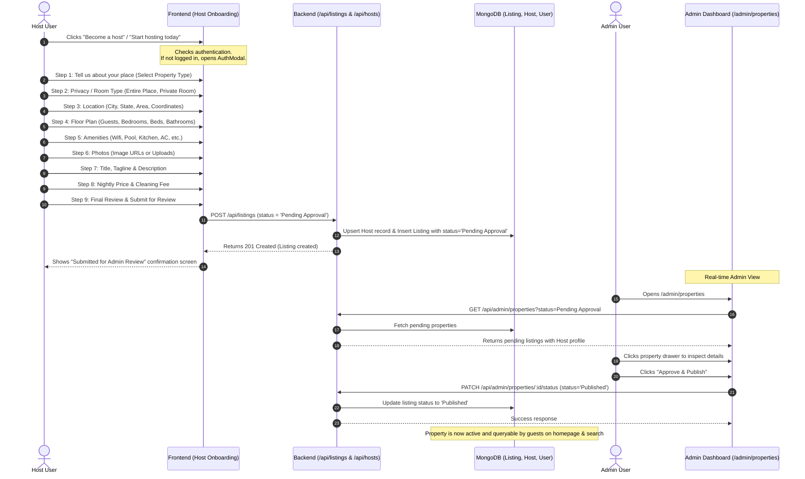

# Implementation Plan: Airbnb-Style Multi-Step Host Onboarding & Admin Approval Workflow

## 1. Overview & Current Problems
1. **Host Button Triggers Alert**: Clicking "Start hosting today" on `/host` currently just triggers a browser alert `alert("Hosting onboarding begins! Setup your listing in 5 minutes.")`.
2. **Missing Airbnb-Style Stepper Flow**: The user wants an authentic Airbnb-style step-by-step onboarding wizard starting from step 1 ("Tell us about your place", selecting category/place type, location, guest counts & amenities, photos, title & description, nightly pricing), matching the exact UI shown in the user's reference screenshots.
3. **Pending Approval & Admin Gatekeeping**:
   - When a host completes the onboarding and submits the listing, the listing status must be created as **`Pending Approval`** in MongoDB (or **`Draft`** if they save and exit).
   - Only an Admin in the Admin Portal ([AdminProperties.tsx](file:///c:/Users/Jashith/Desktop/House-Booking-App/Full-Stack-House-Booking-App/client/src/pages/admin/AdminProperties.tsx)) can inspect the details, verify the photos and pricing, and click **"Approve & Publish"** or **"Reject"**.
   - Public search/browse listings must only show **`Published`** properties so unapproved listings are not visible to regular guests until vetted.

---

## 2. User & System Architecture Workflow



---

## 3. Step-by-Step Implementation Breakdown

### Phase 1: Database Model & Backend Updates
1. **Update [server/src/models/Listing.ts](file:///c:/Users/Jashith/Desktop/House-Booking-App/Full-Stack-House-Booking-App/server/src/models/Listing.ts)**:
   - Add explicit `status` field:
     ```typescript
     status: {
       type: String,
       enum: ['Published', 'Pending Approval', 'Draft', 'Archived'],
       default: 'Pending Approval',
     }
     ```
   - Add index on `status: 1`.
2. **Update [server/src/controllers/listingController.ts](file:///c:/Users/Jashith/Desktop/House-Booking-App/Full-Stack-House-Booking-App/server/src/controllers/listingController.ts)**:
   - In `getListings`, default to `{ status: 'Published' }` for public searches unless requested by admin.
   - In `createListing`:
     - Allow logged-in users (if not yet a `host`, automatically upgrade user role to `host` and ensure a linked `Host` document exists).
     - Set initial status to `'Pending Approval'` (or `'Draft'` if user chooses save & exit).
3. **Update [server/src/controllers/adminController.ts](file:///c:/Users/Jashith/Desktop/House-Booking-App/Full-Stack-House-Booking-App/server/src/controllers/adminController.ts)**:
   - Verify `getAdminProperties` correctly queries both `Published` and `Pending Approval` listings and populates host details.
   - Ensure `updatePropertyStatus` persists status `'Published'`, `'Pending Approval'`, or `'Archived'`.

---

### Phase 2: Frontend Client API & Services
1. **Update [client/src/services/api.ts](file:///c:/Users/Jashith/Desktop/House-Booking-App/Full-Stack-House-Booking-App/client/src/services/api.ts)**:
   - Add `listingsApi.createListing(data)` supporting `status: 'Pending Approval' | 'Draft'`.
   - Add `hostsApi.createOrGetHostProfile()`.

---

### Phase 3: Airbnb-Style Multi-Step Host Onboarding Wizard
1. **Create Route and Wizard Component**:
   - Create route `/become-a-host` or full modal wizard on `/host/onboarding`.
   - Top Bar: Wayfound / Airbnb style with Logo, "Save & exit" button, and "Questions?" button.
   - Bottom Bar: Progress bar across all steps, "Back" button, and prominent "Next" / "Submit" button.
2. **Step Sequence**:
   - **Step 1: Welcome & Overview**: Clean split view with editorial 3D isometric house graphic and "Tell us about your place" heading (matching the screenshot provided by the user).
   - **Step 2: Property Type**: Grid of visual cards (House, Flat/apartment, Barn, Bed & breakfast, Cabin, Campervan, Casa particular, Castle, Villa, Treehouse, etc.).
   - **Step 3: Space Type**: "Entire place", "Private room", or "Shared room".
   - **Step 4: Location**: Interactive Indian address selector (City, State, Area/Street) with Goa, Manali, Mumbai, Udaipur, etc. quick picks.
   - **Step 5: Floor Plan & Capacity**: Stepper counters (+ / -) for:
     - Guests (max capacity)
     - Bedrooms
     - Beds
     - Bathrooms
   - **Step 6: Amenities**: Category-grouped icons (Wifi, Pool, AC, Kitchen, Workspace, Free Parking, Mountain View, etc.).
   - **Step 7: Photos**: Add photo URLs or curated aesthetic architectural photo presets with preview gallery.
   - **Step 8: Title & Description**:
     - Catchy stay title (e.g. "Minimalist Glasshouse Overlooking Coffee Valleys")
     - Tagline / Vibe
     - Detailed description & house rules
   - **Step 9: Pricing**:
     - Nightly base price (with dynamic earnings calculator matching the landing page)
     - Cleaning fee & cancellation policy
   - **Step 10: Review & Submit**:
     - Visual card preview of the listing.
     - Notice: *"Your property will be submitted to the Wayfound Curation & Safety team for review. An admin will verify the listing and publish it within 24 hours."*
     - Button: **"Submit for Admin Review"**.
   - **Step 11: Success Screen**:
     - Celebration badge and link to "View Status in Dashboard" or "Browse Wayfound".

---

### Phase 4: Host Landing Page Connection
1. In [client/src/pages/Host.tsx](file:///c:/Users/Jashith/Desktop/House-Booking-App/Full-Stack-House-Booking-App/client/src/pages/Host.tsx):
   - Replace `onClick={() => alert(...)}` on the "Start hosting today" button with seamless navigation to `/become-a-host`.
   - Wire the navbar "Become a host" links in [Navbar.tsx](file:///c:/Users/Jashith/Desktop/House-Booking-App/Full-Stack-House-Booking-App/client/src/components/layout/Navbar.tsx) and [MobileTabBar.tsx](file:///c:/Users/Jashith/Desktop/House-Booking-App/Full-Stack-House-Booking-App/client/src/components/layout/MobileTabBar.tsx) to `/become-a-host`.

---

### Phase 5: Admin Property Moderation & Publishing
1. In [AdminProperties.tsx](file:///c:/Users/Jashith/Desktop/House-Booking-App/Full-Stack-House-Booking-App/client/src/pages/admin/AdminProperties.tsx):
   - Show dynamic counts for `Pending Approval`, `Published`, and `Archived`.
   - Highlight newly submitted listings in the "Pending Approval" tab with a glowing amber badge.
   - Clicking on a pending property opens the drawer displaying all submitted details (photos, amenities, price, host information).
   - Clicking **"Approve & Publish"** calls `adminApi.updatePropertyStatus(id, { status: 'Published' })`, immediately moving it to Published and enabling it for guest bookings.
   - Clicking **"Reject"** or **"Archive"** calls `adminApi.updatePropertyStatus(id, { status: 'Archived' })`.

---

## 4. Verification & Testing
1. **Host Submission Test**:
   - Log in as a host or regular user.
   - Navigate to `/host` -> click "Start hosting today" -> go through the full Airbnb-style flow.
   - Submit the listing. Verify record is created in MongoDB with `status: 'Pending Approval'`.
2. **Search Index Isolation**:
   - Check public search `/search` or home `/` — verify the unapproved listing does NOT show up for guests.
3. **Admin Approval Test**:
   - Log into `/admin/properties`.
   - Verify the newly created listing appears under `Pending Approval`.
   - Click "Approve & Publish".
   - Refresh `/search` — verify the property is now live and bookable!
